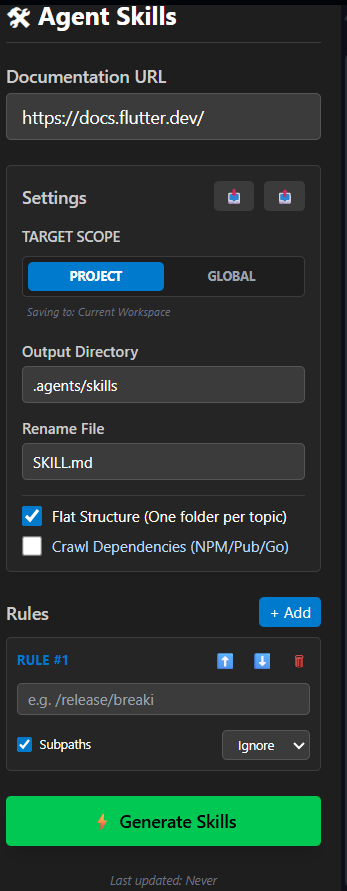

# 🛠 Agent Skills


Agent Skills is a VS Code extension that transforms online documentation into structured, reusable skills for AI agents.

Instead of manually creating context files, Agent Skills crawls documentation websites, extracts relevant information, and generates organized Markdown skill files that can be used by AI coding assistants and agent frameworks.

---

# ✨ Features

## 🌐 Documentation Crawling

* Crawl documentation websites.
* Extract relevant content automatically.
* Generate structured markdown files.
* Support recursive crawling.

## 📦 Dependency Crawling

Automatically discover and crawl dependencies from:

* Pub.dev
* npm
* Go packages

Useful for generating complete AI context across multiple libraries.

---

## ⚙ Rules Engine

Control what gets included or excluded.

### Include Rules

Specify pages that must always be processed.

### Ignore Rules

Exclude paths such as:

* Release notes
* Breaking changes
* Changelogs
* Version-specific pages

Supports subpath matching.

---

## 📁 Output Structure

### Flat Structure

```text
skills/
├── flutter/
│   └── SKILL.md
├── bloc/
│   └── SKILL.md
└── dio/
    └── SKILL.md
```

### Nested Structure

```text
skills/
└── flutter/
    ├── widgets/
    ├── navigation/
    ├── state-management/
    └── SKILL.md
```

---

## 🌍 Scope Support

### Project Scope

Generate skills inside:

```text
.agents/skills/
```

for the current workspace.

### Global Scope

Generate reusable skills inside:

```text
~/.gemini/antigravity/skills/
```

for all projects.

---

## 🎛 Interactive Sidebar

Modern VS Code sidebar UI with:

* Documentation URL input.
* Rules editor.
* Import / Export settings.
* Flat structure toggle.
* Dependency crawling.
* Progress tracking.
* Cancel ongoing crawl.

---

## ⏱ Real-Time Progress

Track:

* Current page being processed.
* Crawl status.
* Completion time.
* Errors.

Supports manual cancellation at any time.

---

# 🏗 Architecture

```text
User
 │
 ▼
Sidebar UI
 │
 ▼
Webview
 │
 ▼
Extension Host
 │
 ▼
SkillsGenerator
 │
 ▼
Crawler Engine
 │
 ▼
Markdown Skill Files
```

---

# 🛠 Tech Stack

## Extension

* TypeScript
* VS Code Extension API

## UI

* Webview API
* TailwindCSS

## Core Components

### extension.ts

Responsible for:

* Activating the extension.
* Registering commands.
* Registering sidebar views.

### sidebarView.ts

Handles:

* Sidebar UI.
* Progress updates.
* Cancellation tokens.
* Communication with the generator.

### SkillsGenerator

Responsible for:

* Crawling websites.
* Parsing content.
* Applying rules.
* Writing markdown skills.

---

# 🚀 Usage

1. Open the Agent Skills sidebar.

2. Enter a documentation URL:

```text
https://docs.flutter.dev
```

3. Configure:

* Output directory.
* Scope.
* Rules.
* Dependency crawling.

4. Press:

```text
⚡ Generate Skills
```

5. Generated skills will appear automatically.

---

# 📸 Screenshots

<p align="center">
  
</p>

---

# 🔮 Roadmap

* Multi-threaded crawling.
* AI-powered summarization.
* HTML → Markdown optimization.
* Search indexing.
* Incremental updates.
* Duplicate detection.
* Import / Export profiles.
* MCP integration.
* Support for GitHub repositories.
* PDF and local documentation crawling.

---

# 👨‍💻 Developer

Built with TypeScript and the VS Code Extension API to automate documentation-to-skill generation workflows for AI agents.

---

# 📄 License

MIT License
